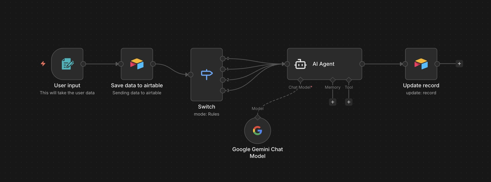
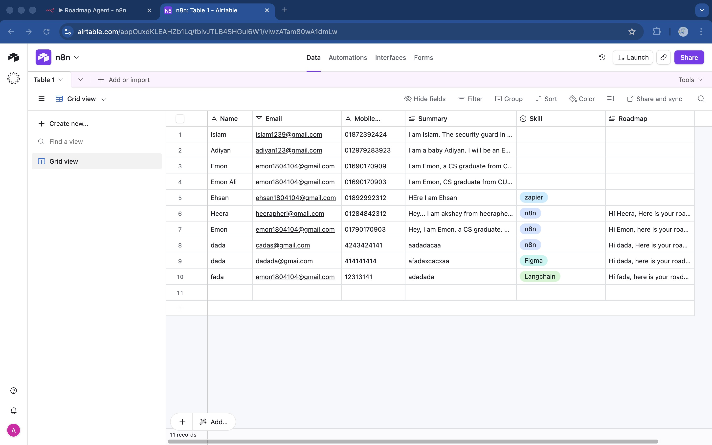
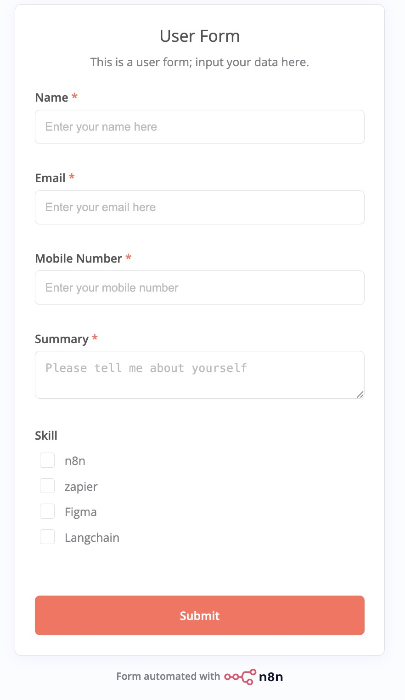

# AI Roadmap Generator Automation (n8n + Airtable + Google AI)

## Overview
This project is an AI-powered automation workflow built using n8n, Airtable, and Google AI. 
The system automatically generates a learning roadmap based on user-selected skill.

## Problem
Many people want to learn new tools like n8n, Zapier, Figma, or LangChain but do not know 
how to start or what roadmap to follow.

## Solution
I built an automated workflow where users submit their information and select a skill through a form.
The workflow stores the data in Airtable via API integration. Based on the selected skill, 
an AI agent generates a structured learning roadmap and automatically updates it back into the Airtable database.

## Tools Used
- n8n
- Airtable API
- Google AI
- Webhooks
- Workflow Automation
- API Integration

## Workflow Steps
1. User submits form
2. Data stored in Airtable via API
3. Switch node checks selected skill
4. AI agent generates roadmap
5. Roadmap saved back to Airtable
6. Entire process is fully automated

## Demo Video
https://youtu.be/aUoXxpNqmU4

## Files
## Screenshots

### n8n Workflow

### Airtable Database

### Form Submission

